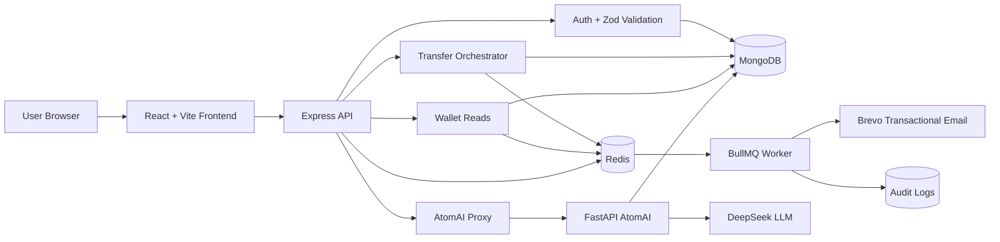

# AtomPay

Production-style digital wallet and peer-to-peer payment system built with React,
Node.js, MongoDB, Redis, BullMQ, and a Python AI assistant.

[](LICENSE.md)


Built by [Akshay Dhankhar](https://github.com/AkshayDhankhar1) and
[Praveen Dhankhar](https://github.com/praveen-dhankhar).

AtomPay is a full-stack wallet project focused on the hard parts of digital
payments: atomic balance updates, retry-safe transfers, distributed rate limits,
cache invalidation, asynchronous side effects, and read-only financial analytics.

> This is an educational/open-source wallet system. It is not a banking product
> and must not be used to process real money.

## Table of Contents

- [Why AtomPay Exists](#why-atompay-exists)
- [What It Does](#what-it-does)
- [Architecture](#architecture)
- [Transfer Flow](#transfer-flow)
- [Repository Layout](#repository-layout)
- [Tech Stack](#tech-stack)
- [Local Development](#local-development)
- [Environment Variables](#environment-variables)
- [API Overview](#api-overview)
- [Reliability and Security Model](#reliability-and-security-model)
- [AtomAI Assistant](#atomai-assistant)
- [Load Testing](#load-testing)
- [Roadmap](#roadmap)
- [Contributing](#contributing)
- [License](#license)

## Why AtomPay Exists

Payment systems fail in uncomfortable ways: the user taps pay twice, the network
drops after debit, a retry reaches the server while the first request is still
running, or two concurrent transfers race against the same balance.

AtomPay is built to make those edge cases explicit. The core idea is simple:

- Money movement must be atomic.
- Retries must not double-charge the sender.
- Reads can be cached, but financial data must be invalidated only after commit.
- Slow side effects such as emails and audit logs should not block the transfer.
- AI can explain wallet data, but it should be read-only and grounded in backend
  data.

## What It Does

AtomPay currently supports:

- Email/password login with OTP verification.
- JWT access tokens and database-backed refresh tokens.
- User wallets with INR balances and generated QR codes.
- Peer-to-peer transfers by username or QR scan.
- MongoDB multi-document transactions for money movement.
- Redis-backed idempotency keys for safe transfer retries.
- Redis-backed distributed rate limiting.
- Redis read-through cache for balance and transaction history.
- BullMQ worker process for transaction emails and audit logs.
- React dashboard, transfer flow, transaction history, settings, and AI screens.
- FastAPI AtomAI service for wallet analytics, spending insights, budgets, and
  read-only chat.

## Architecture



The repository also includes rendered design diagrams:

- [High-level design](docs/atompay-hld.svg)
- [Transfer request flow](docs/atompay-request-flow.svg)

## Transfer Flow

The transfer endpoint is the most important part of the backend.

```text
POST /api/transaction/transfer

1. Authenticate the sender with a JWT access token.
2. Validate the payload with Zod.
3. Apply a per-user Redis rate limit.
4. Claim the Idempotency-Key in Redis with SET NX.
5. Load sender and receiver accounts.
6. Verify both users and wallets are active.
7. Compare the submitted UPI PIN with the stored bcrypt hash.
8. Check available balance before opening the transaction.
9. Check rolling 24-hour transfer velocity.
10. Start a MongoDB session.
11. Re-read both wallets inside the session.
12. Re-check sender balance inside the transaction.
13. Create a pending transaction record.
14. Debit sender and credit receiver.
15. Mark the transaction as success.
16. Commit the MongoDB transaction.
17. Invalidate Redis balance/history cache for both users.
18. Enqueue email and audit jobs.
19. Store the successful idempotency response for replay.
```

If MongoDB detects a write conflict during concurrent transfers, the transaction
is aborted and the losing request is rejected rather than allowing a double-spend.

## Repository Layout

```text
AtomPay/
├── backend/                 # Express API, MongoDB models, Redis, BullMQ
│   ├── controllers/          # Auth, wallet, and transfer controllers
│   ├── db/                   # Mongoose models and Redis/cache helpers
│   ├── middlewares/          # Auth, validation, rate limit, idempotency
│   ├── queues/               # BullMQ producers
│   ├── routes/               # API route definitions
│   ├── scripts/              # Load test and race-condition demo scripts
│   ├── workers/              # BullMQ worker implementations
│   ├── app.js                # Express app configuration
│   ├── index.js              # API server entry point
│   └── worker.js             # Worker process entry point
├── frontend/                 # React/Vite client application
│   ├── src/pages/            # Main UI screens
│   ├── src/components/       # Shared navigation and UI components
│   ├── src/styles/           # Page/component CSS
│   └── src/api.js            # API helper and token refresh logic
├── ai-agent/                 # FastAPI + LangChain AtomAI service
│   ├── main.py               # FastAPI endpoints
│   ├── agent.py              # LangGraph/DeepSeek agent setup
│   ├── tools.py              # Read-only wallet analytics tools
│   ├── db.py                 # Motor async MongoDB queries
│   └── memory.py             # Process-local assistant memory
├── docs/                     # Architecture diagrams and load test report
├── CONTRIBUTING.md           # Contributor guide
├── LICENSE.md                # MIT license
└── README.md                 # Project documentation
```

## Tech Stack

| Layer | Technology | Purpose |
|---|---|---|
| Frontend | React 19, Vite | Wallet UI, QR scan/pay, dashboard, AtomAI UX |
| Backend API | Node.js, Express | Auth, wallet, transfer, and AI proxy endpoints |
| Validation | Zod | Request body validation |
| Database | MongoDB, Mongoose | Users, wallets, transactions, refresh tokens, audit logs |
| Cache/Infra | Redis, ioredis | Cache, idempotency, rate limiting, BullMQ transport |
| Jobs | BullMQ | Async emails and audit logging |
| Email | Brevo SDK | OTP and transaction emails |
| AI service | FastAPI, Motor, LangChain/LangGraph | Read-only analytics and assistant |
| LLM provider | DeepSeek | Tool-using financial assistant |
| Auth | JWT, bcrypt | Access tokens, refresh tokens, password/PIN hashing |

## Local Development

### Prerequisites

- Node.js 18 or newer.
- Python 3.11 or newer.
- MongoDB connection string with replica set support for transactions.
- Redis connection string.
- Brevo API key for email delivery.
- DeepSeek API key if you want AI chat enabled.

### 1. Clone and install

```bash
git clone https://github.com/<your-org-or-user>/AtomPay.git
cd AtomPay

cd backend && npm install
cd ../frontend && npm install
cd ../ai-agent && python3 -m venv .venv
source .venv/bin/activate
pip install -r requirements.txt
```

### 2. Configure environment files

Copy the examples and fill in real values:

```bash
cp backend/.env.example backend/.env
cp frontend/.env.example frontend/.env
cp ai-agent/.env.example ai-agent/.env
```

### 3. Start the services

Run each service in its own terminal.

```bash
cd backend
npm start
```

```bash
cd backend
npm run start:worker
```

```bash
cd ai-agent
source .venv/bin/activate
uvicorn main:app --host 0.0.0.0 --port 8000 --reload
```

```bash
cd frontend
npm run dev
```

Default local URLs:

- Frontend: `http://localhost:5173`
- Backend API: `http://localhost:3000/api`
- AtomAI service: `http://localhost:8000`

## Environment Variables

### Backend

| Variable | Required | Description |
|---|---:|---|
| `PORT` | No | API port. Defaults to `3000`. |
| `MONGO_URL` | Yes | MongoDB connection string. Transactions require replica set support. |
| `REDIS_URL` | Yes | Redis URL for cache, idempotency, rate limits, and BullMQ. |
| `JWT_SECRET` | Yes | Secret used to sign access tokens. |
| `OTP_SECRET` | Yes | Secret used to generate email OTPs. |
| `BREVO_API_KEY` | Yes | Brevo transactional email API key. |
| `CORS_ORIGINS` | No | Comma-separated frontend origins. Defaults to `*`. |
| `AGENT_URL` | No | AtomAI service URL. Defaults to `http://localhost:8000`. |
| `MAINTENANCE_MODE` | No | Set to `true` to return maintenance responses. |

### Frontend

| Variable | Required | Description |
|---|---:|---|
| `VITE_API_BASE_URL` | No | Backend API base URL. Defaults to `http://localhost:3000/api`. |
| `VITE_MAINTENANCE_MODE` | No | Set to `true` to show the maintenance page. |

### AtomAI

| Variable | Required | Description |
|---|---:|---|
| `MONGO_URL` | Yes | Same MongoDB database used by the backend. |
| `PORT` | No | AtomAI port. Defaults to `8000`. |
| `DEEPSEEK_API_KEY` | No | Enables LLM-backed chat. Service still starts without it. |
| `DEEPSEEK_BASE_URL` | No | Defaults to `https://api.deepseek.com`. |
| `DEEPSEEK_MODEL` | No | Defaults to `deepseek-chat`. |
| `VERIFY_RESPONSES` | No | Defaults to `true`; runs a second verification pass. |

## API Overview

All authenticated routes expect:

```http
Authorization: Bearer <access-token>
```

Transfer requests should also send:

```http
Idempotency-Key: <client-generated-uuid>
```

### Auth

| Method | Route | Description |
|---|---|---|
| `POST` | `/api/auth/send-signup-otp` | Send signup OTP. |
| `POST` | `/api/auth/signup` | Create user and wallet. |
| `POST` | `/api/auth/send-otp` | Send login OTP after password verification. |
| `POST` | `/api/auth/verify-otp` | Verify OTP and issue token pair. |
| `POST` | `/api/auth/login` | Password login path. |
| `POST` | `/api/auth/refresh` | Issue a new access token from a refresh token. |
| `POST` | `/api/auth/logout` | Revoke a refresh token. |
| `PATCH` | `/api/auth/change-password` | Change password and revoke refresh tokens. |
| `PATCH` | `/api/auth/change-pin` | Change UPI PIN. |
| `POST` | `/api/auth/forgot-password` | Send reset OTP if account exists. |
| `POST` | `/api/auth/reset-password` | Reset password using OTP. |

### Wallet and Transfers

| Method | Route | Description |
|---|---|---|
| `GET` | `/api/wallet/balance` | Return balance, currency, status, and QR code. |
| `GET` | `/api/wallet/transactions` | Return latest wallet transactions. |
| `POST` | `/api/transaction/transfer` | Send money to another AtomPay user. |

### AtomAI Proxy

| Method | Route | Description |
|---|---|---|
| `GET` | `/api/agent/health` | Check AtomAI availability. |
| `GET` | `/api/agent/capabilities` | Return assistant capabilities. |
| `POST` | `/api/agent/chat` | Proxy chat message to AtomAI. |
| `POST` | `/api/agent/analytics` | Return deterministic analytics bundle. |
| `POST` | `/api/agent/clear-history` | Clear chat history for the user. |
| `POST` | `/api/agent/memory/budget` | Set monthly budget in AtomAI memory. |
| `POST` | `/api/agent/memory/savings-goal` | Set savings goal in AtomAI memory. |
| `POST` | `/api/agent/memory/clear` | Clear AtomAI memory. |

## Reliability and Security Model

### Atomic transfers

Transfers use MongoDB sessions to keep transaction record creation, sender debit,
receiver credit, and success marking in one commit boundary. If any step fails,
the transaction aborts and wallet balances are not partially updated.

### Retry safety

The backend idempotency middleware claims an `Idempotency-Key` in Redis before
the transfer controller runs. Successful responses are cached for replay. Failed
requests release the key so the user can retry.

### Race-condition handling

The sender balance is checked before and inside the MongoDB transaction. A
concurrent write conflict is treated as a blocked race rather than a successful
second debit.

### Cache correctness

Balance and transaction reads are cached in Redis. Transfer cache invalidation
runs only after the MongoDB transaction commits, so the cache is not cleared for
rolled-back transfers.

### Async side effects

Transaction emails and audit logs are queued through BullMQ. The API returns
after the money movement has committed; non-critical side effects are processed
by `npm run start:worker`.

### Current security notes

- Passwords and UPI PINs are hashed separately with bcrypt.
- Access tokens expire in 15 minutes.
- Refresh tokens are stored server-side and can be revoked.
- OTPs are generated with `speakeasy` and delivered by Brevo.
- The FastAPI AI service is intended to sit behind the Node API proxy in
  deployed environments.
- Frontend tokens are stored in browser storage, so production deployments
  should harden the frontend against XSS and consider httpOnly cookie-based
  session storage.

## AtomAI Assistant

AtomAI is a separate FastAPI service. It provides:

- Balance and wallet status answers.
- Recent transaction lookup.
- Spending analytics over configurable periods.
- Daily transfer limit usage.
- Month-over-month comparisons.
- Recurring payment detection.
- Cashflow forecast.
- Monthly budget and savings goal tracking.
- Product-scope grounding so it does not claim AtomPay supports unsupported
  banking features.

The analytics endpoints are deterministic MongoDB reads. The chat endpoint uses
LangGraph/LangChain tools and can run an additional verification pass to reduce
hallucinated account-specific claims.

Memory for budgets, goals, and notes is currently process-local inside
`ai-agent/memory.py`; it resets on service restart.

## Load Testing

The repo includes an existing load-test report:

- [docs/LOAD_TEST.md](docs/LOAD_TEST.md)

Available backend scripts:

```bash
cd backend

# Basic API and cached-read benchmark
node scripts/loadtest.js

# Include authenticated cached-read benchmark
TOKEN="<access token>" node scripts/loadtest.js

# Demonstrate transfer race/idempotency behavior
TOKEN="<access token>" RECEIVER="receiver_username" PIN="123456" node scripts/race-demo.js
```

The published report records the app-layer endpoint sustaining thousands of
requests per second locally, while cached wallet reads are bounded by remote
free-tier Redis/MongoDB latency.

## Roadmap

Planned improvements:

- PIN lockout after repeated failed attempts.
- Persistent AtomAI memory.
- Internal authentication between Node API and AtomAI service.
- Webhook delivery and replay.
- Reconciliation engine.
- Wallet-to-bank mock withdrawals.
- Split bills and request-money flow.
- CI workflow for lint/build/smoke checks.
- Stronger frontend XSS hardening and token storage strategy.

## Contributing

Contributions are welcome. Good first areas:

- Improve tests around transfer edge cases.
- Add CI for backend syntax checks, frontend build, and Python compile checks.
- Improve AtomAI persistence and service-to-service auth.
- Expand API documentation.
- Fix accessibility and responsive UI issues.

Before opening a pull request:

1. Keep changes focused and easy to review.
2. Do not commit `.env` files, secrets, database dumps, or generated dependency
   folders.
3. Update docs when behavior, setup, routes, or environment variables change.
4. Run the relevant checks for the service you touched.

See [CONTRIBUTING.md](CONTRIBUTING.md) for the contributor workflow.

## License

AtomPay is released under the [MIT License](LICENSE.md).
